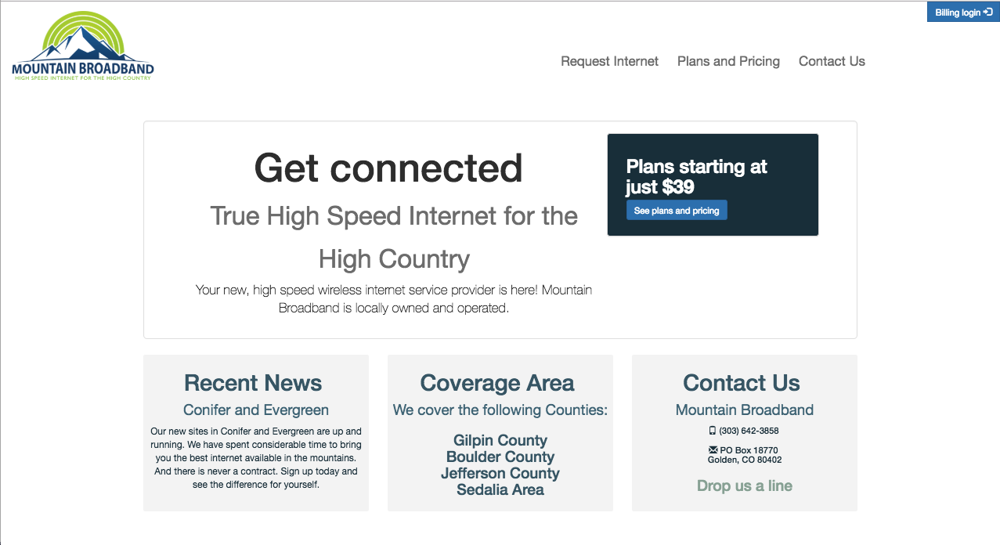
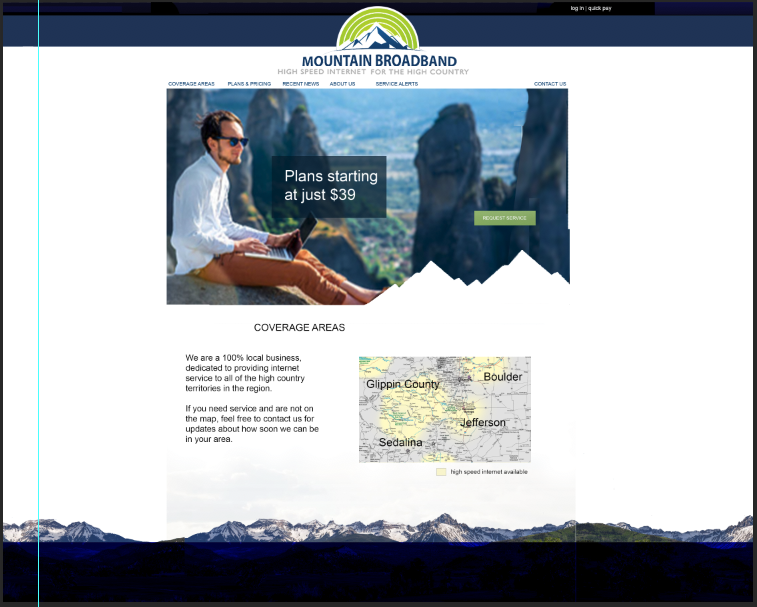

Assignment: To redesign a website for a company that provides internet to the rural mountains.

Design strategy:

1. Communicate the freedom of being in the remote mountains. while still having a connection to the internet.

2. Since it is a utility, try to make the design conservative and solid. Communicate a sense of reliability.

_Original website:_

_First draft mockup of my redesign:_

